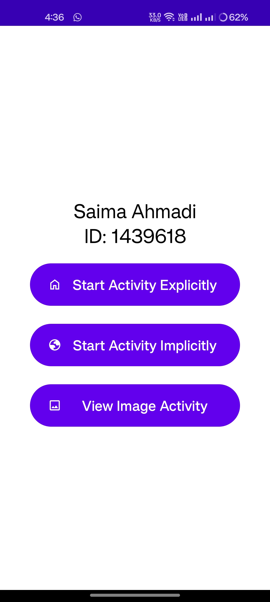
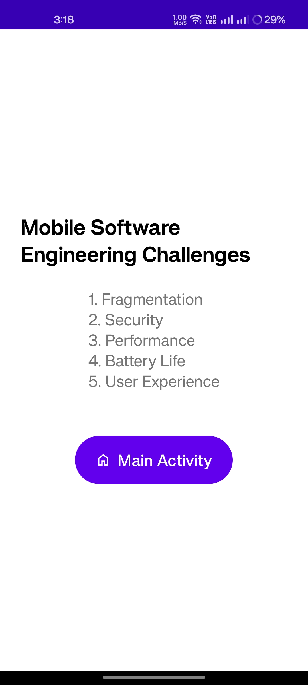
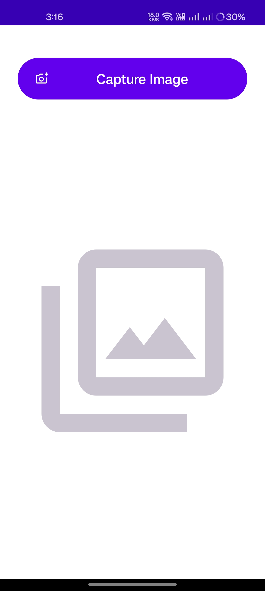
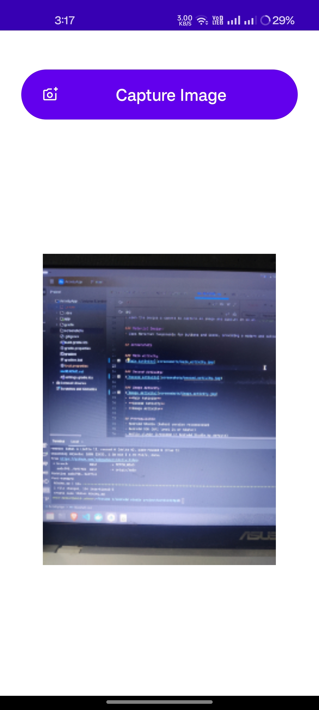

# ActivityApp

ActivityApp is a simple Android application that demonstrates navigation between activities using explicit and implicit intents. It also showcases how to capture and display an image using the device's camera. The app is built using Kotlin and follows modern Android development practices.

## Features

### Explicit Intent:
- Navigate to a second activity (`SecondActivity`) that displays a list of mobile software engineering challenges.

### Implicit Intent:
- Open a website (e.g., [example.com](https://www.example.com)) in the default browser.

### Image Capture:
- Open the device's camera to capture an image and display it in an `ImageView`.

### Material Design:
- Uses Material Components for buttons and icons, providing a modern and polished UI.

## Screenshots

### Main Activity:


### Second Activity:


### Image Activity:
- **Image Activity (before)**  
  
- **Image Activity (After)**  
  


## Prerequisites
- Android Studio (latest version recommended)
- Android SDK (API level 24 or higher)
- Kotlin plugin (included in Android Studio by default)
- Tested on **Pixel 4a (API 33 Emulator)**
- Minimum Android version: **Android 7 (API 24)**
- Android Studio (latest version recommended)
- Android SDK (API level 24 or higher)
- Kotlin plugin (included in Android Studio by default)

## Installation

### Clone the Repository:
```sh
git clone https://github.com/saimaahmedi/ActivityApp.git
```

### Open the Project:
1. Open Android Studio.
2. Select **Open an Existing Project**.
3. Navigate to the cloned repository and select the **ActivityApp** folder.

### Build and Run:
1. Connect an Android device or start an emulator.
2. Click on the **Run** button in Android Studio to build and run the app.

## Code Structure

### 1. `MainActivity.kt`
- The main activity of the app.
- Contains buttons to navigate to `SecondActivity`, open a website, and capture an image.

### 2. `SecondActivity.kt`
- Displays a list of mobile software engineering challenges.
- Contains a button to return to the main activity.

### 3. `ImageActivity.kt`
- Opens the device's camera to capture an image.
- Displays the captured image in an `ImageView`.

### 4. Layout Files
- `activity_main.xml`: Layout for the main activity.
- `activity_second.xml`: Layout for the second activity.
- `activity_image.xml`: Layout for the image activity.

## Permissions
The app requires the following permissions:

### Camera Permission:
To capture images using the device's camera. Declared in `AndroidManifest.xml`:
```xml
<uses-permission android:name="android.permission.CAMERA" />
```

### Internet Permission (for implicit intent):
To open a website in the browser. Declared in `AndroidManifest.xml`:
```xml
<uses-permission android:name="android.permission.INTERNET" />
```

## Dependencies
The app uses the following dependencies:

### Material Components:
For modern UI components like `MaterialButton`. Added in `build.gradle`:
```gradle
implementation 'com.google.android.material:material:1.11.0'
```

### ConstraintLayout:
For flexible and responsive layouts. Added in `build.gradle`:
```gradle
implementation 'androidx.constraintlayout:constraintlayout:2.1.4'
```

## How to Use

### Main Activity:
- Click on **Start Activity Explicitly** to navigate to `SecondActivity`.
- Click on **Start Activity Implicitly** to open a website in the browser.
- Click on **View Image Activity** to capture and display an image.

### Second Activity:
- Displays a list of mobile software engineering challenges.
- Click on **Main Activity** to return to the main screen.

### Image Activity:
- Opens the device's camera to capture an image.
- Displays the captured image in an `ImageView`.

## Troubleshooting

### Camera Permission Denied:
- If the camera permission is denied, the app will show a Snackbar explaining why the permission is required.
- You can manually enable the permission in the **app settings**.

### App Crashes on Launch:
- Ensure that all activities are declared in `AndroidManifest.xml`.
- Ensure that all drawable resources (e.g., `home_24px`, `globe_24px`) exist in the `res/drawable` folder.

### Website Not Opening:
- Ensure that the device has an active internet connection.
- Ensure that the URL in the implicit intent is correct.

## Contributing
Contributions are welcome! If you find any issues or have suggestions for improvement, please open an issue or submit a pull request.


## Acknowledgments
- **[Android Developers Documentation](https://developer.android.com/)**: For providing comprehensive guides and tutorials.
- **[Material Design](https://material.io/)**: For the beautiful and intuitive UI components.

